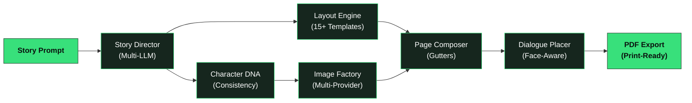
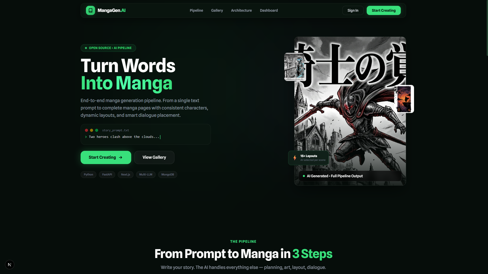
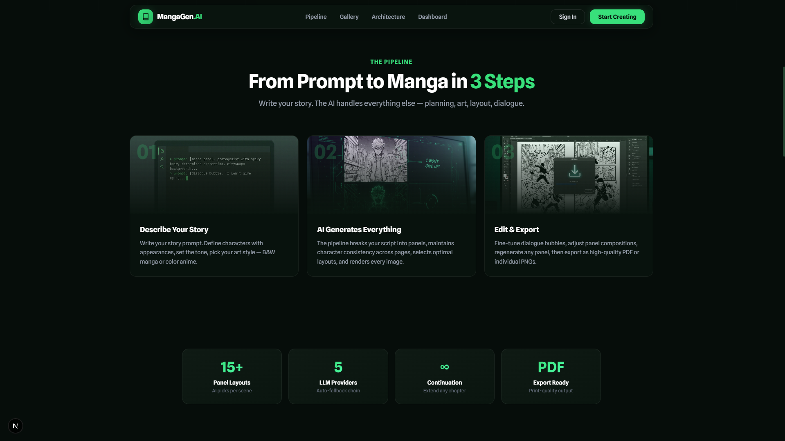
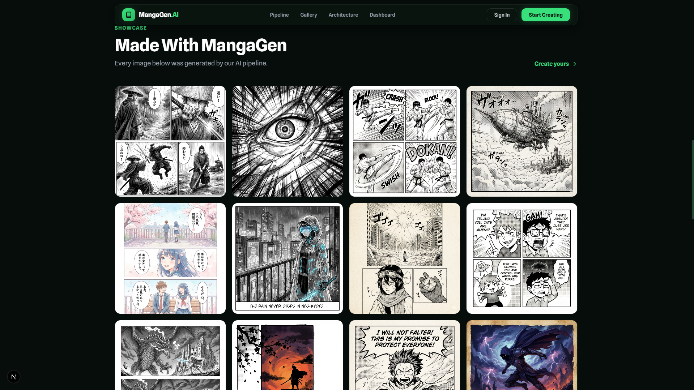
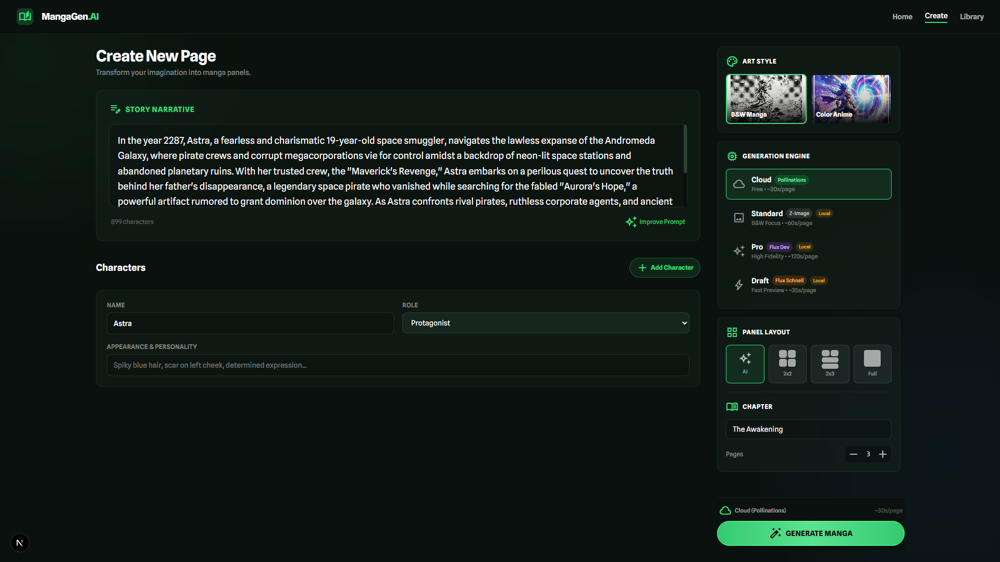
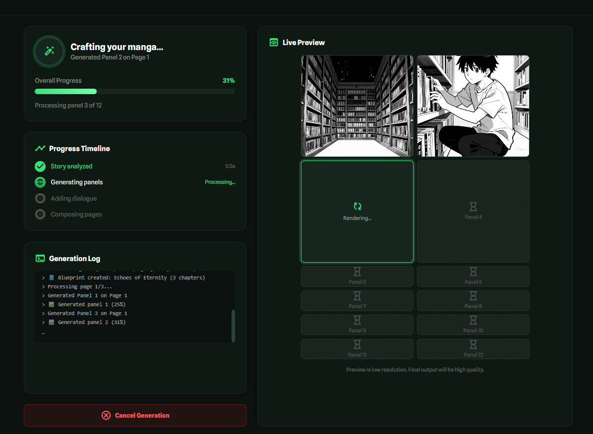
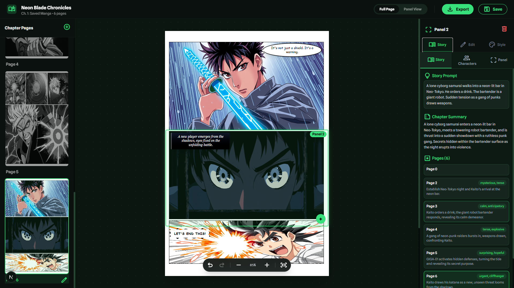
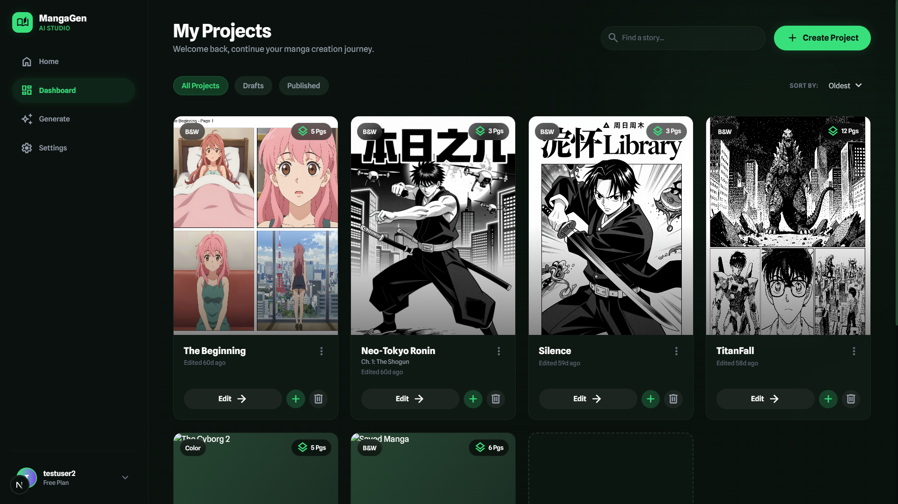
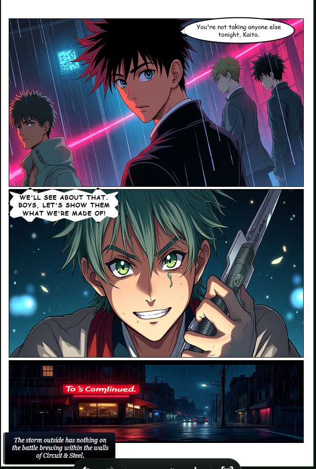
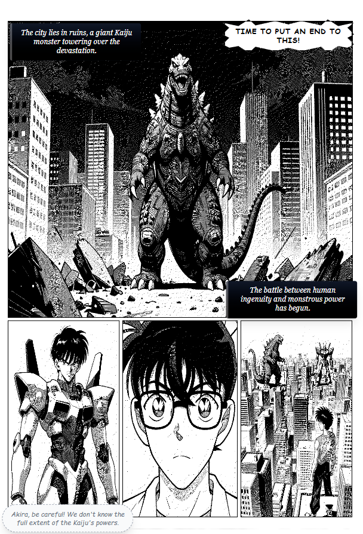

<div align="center">

# MangaGen

### AI-Powered Manga Generation Pipeline

**From a single story prompt to a fully formatted manga — with consistent characters, dynamic layouts, and intelligent dialogue placement.**

[](https://python.org)
[](https://fastapi.tiangolo.com)
[](https://nextjs.org)
[](https://typescriptlang.org)
[](https://mongodb.com)

<br/>

*Born out of frustration — because AI art generators give you different faces every panel and zero storytelling.*

[Get Started](#quick-start) · [Architecture](#architecture) · [Screenshots](#screenshots) · [Features](#features)

</div>

---

## What is MangaGen?

Most AI art tools stop at "here's an image." MangaGen is an **end-to-end pipeline** that chains together story planning, character consistency, panel layouts, dialogue placement, and multi-page exports.

> **The difference:** Instead of generating random images, MangaGen delivers a complete manga chapter — with the same characters looking the same across every panel, layouts that match the narrative mood, and dialogue bubbles that don't cover faces.

<br/>

## Architecture

The pipeline processes a story prompt through seven specialized stages:

| Stage | Component | What It Does |
|-------|-----------|-------------|
| 1 | **Story Director** | LLM plans the full chapter — scene breakdown, pacing, panel descriptions, dialogue |
| 2 | **Character DNA** | Extracts visual traits (hair, eyes, outfit) and locks them across all panels |
| 3 | **Layout Engine** | Picks from 15+ templates based on scene type (action → diagonal splits, dialogue → talking heads) |
| 4 | **Image Factory** | Generates panels via Pollinations (cloud) or ComfyUI (local Flux/SDXL) |
| 5 | **Page Composer** | Stitches panels into manga pages with proper gutters and framing |
| 6 | **Dialogue Placer** | Uses face detection to place speech bubbles without covering characters |
| 7 | **PDF Export** | Renders dialogue onto images and exports as a print-ready PDF |



> For a deeper technical dive, see [docs/ARCHITECTURE.md](docs/ARCHITECTURE.md) — includes sequence diagrams, BYOK flow, and the FallbackLLM chain.

<br/>

## Screenshots

<details open>
<summary><b>Landing Page</b></summary>
<br/>





</details>

<details open>
<summary><b>Create Page — Story & Configuration</b></summary>
<br/>



</details>

<details open>
<summary><b>Live Generation Preview</b></summary>
<br/>



</details>

<details open>
<summary><b>Canvas Editor — Dialogue & Export</b></summary>
<br/>



</details>

<details open>
<summary><b>Dashboard — Project Library</b></summary>
<br/>



</details>

<br/>

## Sample Outputs

<table>
<tr>
<td></td>
<td></td>
</tr>
<tr>
<td align="center"><em>Color Anime style</em></td>
<td align="center"><em>B&W Manga style</em></td>
</tr>
</table>

> *Actual MangaGen outputs — no manual editing or post-processing.*

<br/>

## Features

<table>
<tr>
<td width="50%">

### Character Consistency
The DNA system extracts visual traits from your character descriptions and injects them into every panel prompt. Same character, same face, every time.

### Dynamic Layouts
The LLM picks layouts based on narrative context — hero spreads for reveals, diagonal grids for fight scenes, conversation panels for dialogue-heavy moments.

### Smart Dialogue Placement
Face detection ensures speech bubbles never cover a character's face. Supports speech, thought, shout, whisper, and narrator bubble styles.

</td>
<td width="50%">

### Multi-LLM Fallback
Groq → NVIDIA NIM → Gemini → OpenRouter. If one provider goes down or hits rate limits, the pipeline automatically switches to the next. No single point of failure.

### Infinite Continuation
Add 3 more pages to your 9-page manga and get a 12-page story — not two separate projects. Story context carries forward across generation sessions.

### Cloud + Local Engines
Pollinations for cloud-based generation, ComfyUI with Flux Dev/Schnell for local high-fidelity output. Switch between them without changing your workflow.

</td>
</tr>
</table>

<br/>

## Tech Stack

| Layer | Technology | Purpose |
|-------|-----------|---------|
| **Frontend** | Next.js 16, React 19, TypeScript | Canvas editor, real-time preview, dashboard |
| **Backend** | Python 3.10, FastAPI | Generation pipeline, project management, auth |
| **Image Gen** | Pollinations (cloud), ComfyUI + Flux (local) | Panel generation with multiple engine options |
| **LLM** | Groq/Llama-70B, Gemini, NVIDIA NIM, OpenRouter | Story planning, dialogue, prompt enhancement |
| **Database** | MongoDB Atlas | User accounts, project persistence |
| **Face Detection** | OpenCV, face_recognition | Smart dialogue bubble placement |
| **Export** | Pillow, ReportLab | PDF/PNG/ZIP with rendered dialogue |

<br/>

## Quick Start

### Prerequisites
- Python 3.10+
- Node.js 18+
- At least one LLM API key ([Groq](https://console.groq.com) is free and recommended)
- [Pollinations API key](https://enter.pollinations.ai) (free tier available)

### Setup

```bash
# Clone
git clone https://github.com/Barun-2005/manga-gen-ai-pipeline.git
cd manga-gen-ai-pipeline

# Backend
pip install -r requirements.txt
cp .env.example .env        # Add your API keys

# Frontend
cd frontend && npm install
```

### Run

```bash
# Terminal 1 — Backend API
py -3.10 -m uvicorn api.main:app --reload --port 8000

# Terminal 2 — Frontend
cd frontend && npm run dev
```

Open **http://localhost:3000** → Create → Write your story → Generate.

> **Tip:** You need a Pollinations API key for cloud image generation (get one free at [enter.pollinations.ai](https://enter.pollinations.ai)). For local generation, you'll also need ComfyUI running with Flux models.

<br/>

## Project Structure

```
manga-gen-ai-pipeline/
│
├── api/                    # FastAPI backend
│   ├── main.py             # Core API — generation, projects, export
│   ├── routes/auth.py      # JWT authentication
│   └── middleware.py       # Request logging
│
├── src/
│   ├── ai/
│   │   ├── story_director.py   # LLM-powered story planning & pacing
│   │   ├── image_factory.py    # Multi-provider image generation
│   │   ├── character_dna.py    # Visual consistency across panels
│   │   └── llm_factory.py      # Multi-LLM with automatic fallback
│   ├── database/
│   │   └── mongodb.py          # Atlas connection, project CRUD
│   └── utils/                  # Shared helpers
│
├── scripts/
│   ├── generate_manga.py       # Core MangaGenerator class
│   ├── generate_panels_api.py  # Pollinations & image provider APIs
│   ├── layout_templates.py     # 15+ dynamic panel layouts
│   └── face_detector.py        # Face detection for bubble placement
│
├── frontend/               # Next.js 16 + React 19
│   └── src/app/
│       ├── page.tsx            # Landing page
│       ├── create/page.tsx     # Story input + configuration
│       ├── preview/[jobId]/    # Live generation + canvas editor
│       └── dashboard/page.tsx  # Project library
│
├── .env.example            # Environment template
└── requirements.txt        # Python dependencies
```

<br/>

## Built With

- **[Pollinations.ai](https://pollinations.ai)** — Cloud image generation (credit-based, free tier available)
- **[Groq](https://groq.com)** — Fast LLM inference (free tier)
- **[Google Gemini](https://ai.google.dev)** — Multimodal AI
- **[NVIDIA NIM](https://build.nvidia.com)** — Enterprise AI endpoints
- **[ComfyUI](https://github.com/comfyanonymous/ComfyUI)** — Local Flux/SDXL generation

<br/>

## License

MIT License — use it, break it, make it better.

---

<div align="center">

**Made by [Barun](https://github.com/Barun-2005)**

*A 2-year passion project.*

</div>
