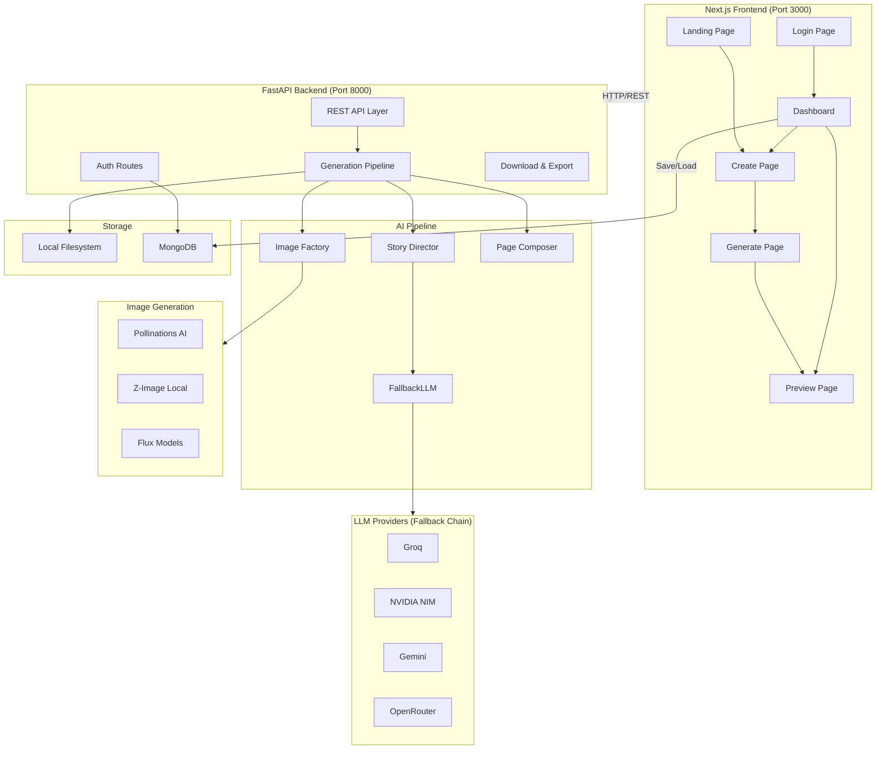

# Architecture

Technical deep-dive into MangaGen's internals. For project overview, see [README.md](../README.md).

## System Architecture



## Generation Pipeline

```mermaid
sequenceDiagram
    participant U as User
    participant FE as Frontend
    participant BE as Backend
    participant LLM as FallbackLLM
    participant IMG as Image Generator
    participant CMP as Composer

    U->>FE: Submit prompt + settings
    FE->>BE: POST /api/generate
    BE->>BE: Create job, start background task

    rect rgb(30, 50, 40)
        Note over BE,LLM: Step 1: Story Planning
        BE->>LLM: Plan chapter (prompt, characters)
        LLM-->>BE: Panel blueprints (descriptions, layout, emotions)
    end

    rect rgb(30, 40, 50)
        Note over BE,IMG: Step 2: Panel Generation
        loop For each panel
            BE->>IMG: Generate image (prompt, style, seed)
            IMG-->>BE: Panel image
            BE->>FE: Update progress (WebSocket-like polling)
        end
    end

    rect rgb(40, 30, 50)
        Note over BE,CMP: Step 3: Page Composition
        BE->>CMP: Compose panels into manga pages
        CMP-->>BE: Full page images
    end

    rect rgb(50, 40, 30)
        Note over BE,IMG: Step 4: Cover Generation
        BE->>IMG: Generate cover art
        IMG-->>BE: Cover image
    end

    BE-->>FE: Job complete
    FE->>U: Show preview with dialogue editor
```



## BYOK (Bring Your Own Key)

Users can provide their own API keys instead of relying on server-configured keys.

```
Frontend (localStorage)              Backend (run_generation)
─────────────────────                ────────────────────────
mangagen_api_keys = {                Priority: BYOK > Server .env
  GROQ_API_KEY: "...",               
  POLLINATIONS_API_KEY: "...",       if request.api_keys.POLLINATIONS_API_KEY:
  NVIDIA_API_KEY: "..."                  os.environ["POLLINATIONS_API_KEY"] = key
}                                    
    │                                LLM keys → FallbackLLM init
    └──► POST /api/generate          Image keys → os.environ override
         body.api_keys: {...}
```

## FallbackLLM Chain

The LLM system tries providers in order until one succeeds:

```
Groq (fastest, free tier)
  ↓ fails/rate-limited
NVIDIA NIM (high quality)
  ↓ fails
Gemini (Google, reliable)
  ↓ fails
OpenRouter (aggregator, last resort)
  ↓ all fail
RuntimeError("All LLM providers failed!")
```

Each provider handles its own rate limiting and error recovery.

## Image Generation Engines

| Engine | Provider | Speed | Quality | Key Required |
|--------|----------|-------|---------|-------------|
| `pollinations` | Pollinations AI (cloud) | ~10s/panel | Good | Yes |
| `z_image` | Local Z-Image | ~30s/panel | Varies | No |
| `flux_dev` | Flux Pro (cloud) | ~15s/panel | Excellent | Yes |
| `flux_schnell` | Flux Schnell (cloud) | ~5s/panel | Good | Yes |

## Directory Structure

```
MangaGen/
├── api/
│   ├── main.py              # FastAPI app, all endpoints
│   └── routes/auth.py       # Authentication endpoints
├── frontend/
│   ├── src/
│   │   ├── app/             # Next.js pages (create, preview, dashboard, etc.)
│   │   ├── components/      # Reusable components (DialogueLayer, StoryViewer)
│   │   └── config.ts        # Centralized API_URL configuration
│   └── public/              # Static assets, gallery images
├── src/
│   ├── ai/
│   │   ├── story_director.py   # LLM-powered story planning
│   │   ├── image_factory.py    # Multi-engine image generation
│   │   └── llm_factory.py      # FallbackLLM provider chain
│   ├── manga/
│   │   └── page_composer.py    # Panel → page layout composition
│   └── database/
│       └── mongodb.py          # MongoDB connection & operations
├── scripts/
│   └── generate_manga.py      # Core MangaGenerator class
└── outputs/                    # Generated manga files (gitignored)
```

## Environment Variables

See [.env.example](../.env.example) for all configurable keys. Critical ones:

| Variable | Required | Description |
|----------|----------|-------------|
| `GROQ_API_KEY` | Yes* | Primary LLM provider |
| `NVIDIA_API_KEY` | Yes* | Fallback LLM provider |
| `POLLINATIONS_API_KEY` | Recommended | Image generation |
| `GEMINI_API_KEY` | Optional | Fallback LLM |
| `MONGODB_URL` | Optional | User auth & project persistence |
| `NEXT_PUBLIC_API_URL` | Production | Frontend → Backend URL |

*At least one LLM key (Groq or NVIDIA) is required.
